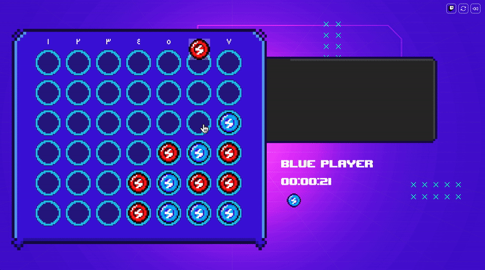

# Connect4 for Twitch
Connect is a two-player connection board game, in which the players take turns dropping colored tokens into a seven-column, six-row vertically suspended grid. The objective of the game is to be the first to form a horizontal, vertical, or diagonal line of four of one's own tokens.

## Project Description
The project aims to make the game playable
through Twitch chat with extra settings.




## Frameworks
- ReactJS
- tmiJS
- TaillwindCSS
 

## Running The Game

### Online

You can preview the project online by clicking [here](https://connect4-twitch.surge.sh/) 


### Locally
#### Prerequisites
- NodeJS

#### 1.  Go to project directory
```sh
cd <project path>
```

#### 2. Install project libraries
```sh
npm install
```

#### 3. Run the app in the development mode 
```sh
npm run start
```

Then you can preview it in your browser using [http://localhost:3000](http://localhost:3000)


## Bugs

|     #       |  Status 
|----------------|----------------
| The game sometimes fails to only allow a message from the specified Twitch players | ✅
| If user selects a fully filled column, the next player starts | ✅

## TODO
|     #        |  Status  
|----------------|----------------
| Playable through Twitch | ✅
| Only specified users can play | ✅
| User streaming the board can click | ✅
| Customizable command for playing | ✅
| Redesign connect4 board | ✅
| Notification pop-up containing next player name | ✅
| Allow switching players colors | ✅
| Popup at end of game showing the winner name | ✅
| Dark Mode | ✅
| Board Customization (size, color ...etc) | ⬜️


## Credits
The game logic is forked from this 
[repo here](https://github.com/mtliendo/connect4).

## Contribution
All contributions are welcome!